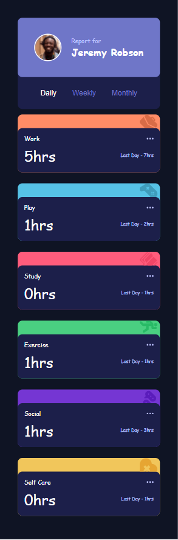
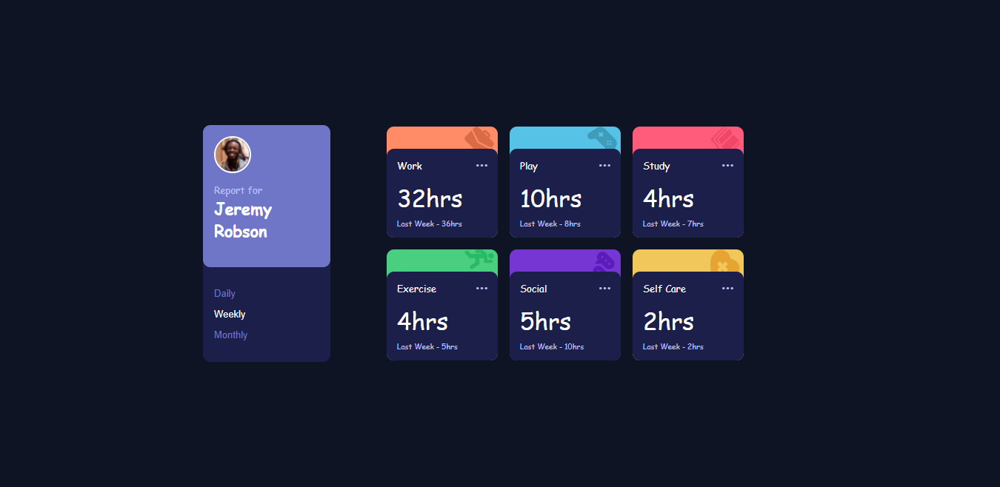

# Frontend Mentor - Time tracking dashboard solution

This is a solution to the [Time tracking dashboard challenge on Frontend Mentor](https://www.frontendmentor.io/challenges/time-tracking-dashboard-UIQ7167Jw). Frontend Mentor challenges help you improve your coding skills by building realistic projects.

## Table of contents

- [Overview](#overview)
  - [The challenge](#the-challenge)
  - [Screenshot](#screenshot)
  - [Links](#links)
- [My process](#my-process)
  - [Built with](#built-with)
  - [What I learned](#what-i-learned)
  - [Continued development](#continued-development)
  - [Useful resources](#useful-resources)
- [Author](#author)
- [Acknowledgments](#acknowledgments)

## Overview

### The challenge

Users should be able to:

- View the optimal layout for the site depending on their device's screen size
- See hover states for all interactive elements on the page
- Switch between viewing Daily, Weekly, and Monthly stats

### Screenshot

| Mobile                                         | Desktop                                          |
| ---------------------------------------------- | ------------------------------------------------ |
|  |  |

### Links

- Solution URL: [Add solution URL here](https://your-solution-url.com)
- Live Site URL: [Add live site URL here](https://your-live-site-url.com)

## My process

### Built with

- HTML5 markup
- CSS custom properties
- Sass
- Flexbox
- Mobile-first workflow
- [React](https://reactjs.org/) - JS library

### What I learned

- **Break the normal:**
  modifing the `data.json` file gived me the control to make a single component for displaying each card and reuse it again.

```
return (
    <div className="time-cards-container">
      {data.map((card) => (
        <TimeCard trackerType={trackerType} key={card.title} card={card} />
      ))}
    </div>
  );

```

- **Sass make it super easy to style this dashboard:**

```
  .card {
    margin: 8px;
    height: 150px;
    width: 150px;
    border-radius: 10px;
    padding: 0;
    &_info {
      border-radius: 10px;
      height: 80%;
      padding: 14px;
      background-color: $Dark-blue;
      &:hover {
        background-color: $Desaturated-blue;
        filter: brightness(90%);
        cursor: pointer;
      }
    }
```

- **TSX or React TypeScript is a wonderfull combination to work with:**

```
  const [tracker, setTracker] = useState("daily");
  useEffect(() => {
    if (trackerType === "daily") setTracker("Day");
    else if (trackerType === "weekly") setTracker("Week");
    else setTracker("Month");
  }, [trackerType]);

```

### Continued development

**I want to develop this Design and make it live as an app that can do the following:**

- Enter the hours/day.
- Enable notifications.
- Save data to DB.
- Enable Signup/Signin for every user.
- Display Warning Messages for custom data results.

### Useful resources

- [W3Schools](https://www.w3schools.com/css/default.asp) - It is a good reference to use if you forget CSS3.

## Author

- Website - [Latif Essam](https://www.your-site.com)
- Frontend Mentor - [@latif-essam](https://www.frontendmentor.io/profile/latif-essam)
- Twitter - [@latif_essam](https://www.twitter.com/latif_essam)
